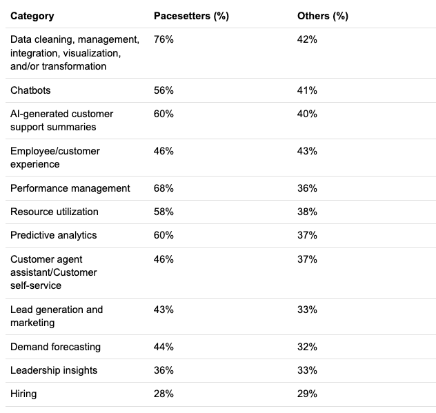
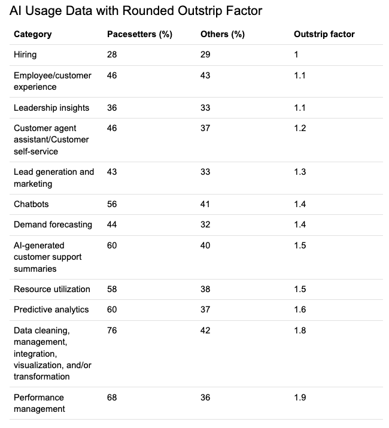

# Introduction
This is the source data for the companion article which discusses how AI is being used in Performance Management in "pacesetter" organizations.

The data are provided in two formats - Markdown, for easy visualziation; and as CSV for those interested in reproducing or extending my analysis
## Base Data

[Supporting Data, in Markdown format](./ai-pacesetters.md)

[Supporting Data, in CSV format](./ai-pacesetters.csv)

## Data with Outstrip Factor

[Supporting Data, in Markdown format](./ai-pacesetters-with-outstrip-factor.md)

[Supporting Data, in CSV format](./ai-pacesetters-with-outstrip-factor.csv)

---
