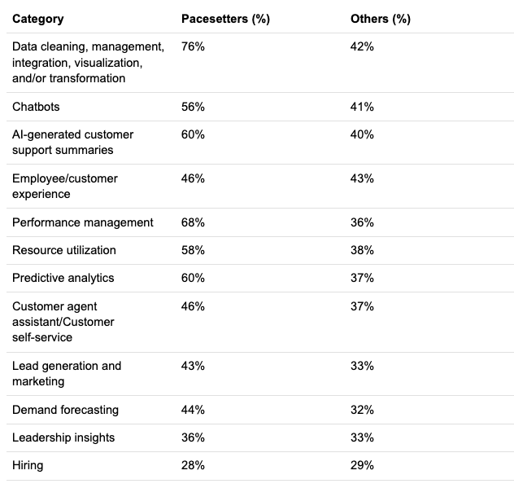
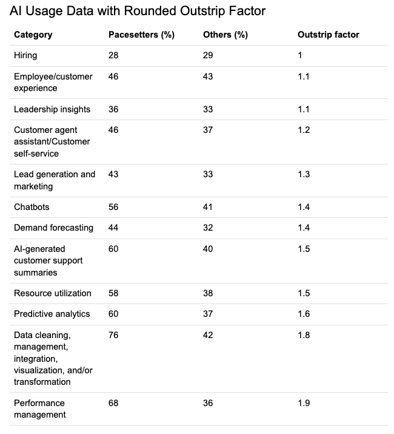

# Introduction
## Project Summary
- Status: Dataset
- Problem: Summarize how AI is used in performance management by pacesetter orgs
- Why AI: Structure and compare qualitative descriptions across organizations
- Artifacts: `ai-pacesetters.md/.csv`, `ai-pacesetters-with-outstrip-factor.md/.csv`

This is the source data for the companion article which discusses how AI is being used in Performance Management in "pacesetter" organizations.

The data is provided in two formats: Markdown for easy visualization, and CSV for those interested in reproducing or extending the analysis.
## Base Data

[Supporting Data, in Markdown format](./ai-pacesetters.md)

[Supporting Data, in CSV format](./ai-pacesetters.csv)

## Data with Outstrip Factor

[Supporting Data, in Markdown format](./ai-pacesetters-with-outstrip-factor.md)

[Supporting Data, in CSV format](./ai-pacesetters-with-outstrip-factor.csv)

---
