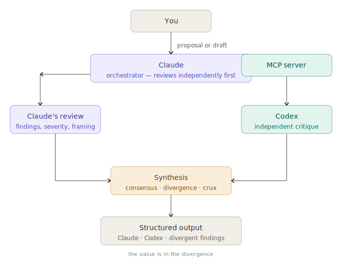

# multi-model-review

A Claude skill that orchestrates adversarial, multi-perspective reviews using Claude as the orchestrator and OpenAI Codex as a second-opinion reviewer via MCP.



The core insight: **the value is in the divergence**. When two models trained on different data, tuned differently, flag different things — that's the signal worth investigating. Consensus is noise. Disagreement is the finding.

---

## What it does

Runs one of four review modes against any content — proposal, draft, design doc, or code — using both Claude and Codex independently, then synthesizes into a structured output that surfaces where the models agree, where they diverge, and what the single most important unresolved issue is.

| Mode | Best for |
|------|----------|
| Red Team | Proposals, plans, architecture docs — find what breaks |
| Steelman | Drafts and ideas — find the strongest version |
| Debate | Claims and arguments — stress-test both sides |
| Code Review | Code — correctness, security, edge cases |

---

## Prerequisites

**1. Codex CLI installed**
```bash
npm install -g @openai/codex
codex login   # or: export OPENAI_API_KEY=your-key
```

**2. Codex registered as an MCP server in Claude Code**
```bash
claude mcp add codex -- npx codex mcp-server
claude mcp list   # verify it appears
```

---

## Usage

Trigger phrases (any of these will activate the skill):

- `"red team this proposal"`
- `"review this with Codex"`
- `"get a second opinion on this"`
- `"steelman this draft"`
- `"have Codex critique this"`
- `"multi-model review"`
- `"debate this"`
- `"review this code with another model"`

The skill defaults to red team if no mode is specified.

---

## Proof of Concept

See [mmr-test.md](mmr-test.md) for the test prompt and a full example response.

---

## How it works

```
You (prompt)
    ↓
Claude reviews independently   →   Claude's findings
    ↓
Claude calls Codex via MCP     →   Codex's findings
    ↓
Claude synthesizes both
    ↓
Consensus / Divergence / Crux / Next Step
```

Claude always reviews first, before calling Codex. This keeps the reviews independent — if Claude saw Codex's output first, it would anchor on it.

---

## Output format

```
## Claude's [Mode] Review
[findings]

## Codex's [Mode] Review
[findings]

## Synthesis

CONSENSUS (both flagged):
- ...

DIVERGENT — Claude only:
- ...

DIVERGENT — Codex only:
- ...

THE CRUX: [single most important unresolved question]

RECOMMENDED NEXT STEP: [one concrete action]
```

---

## Extending to more models

Once PAL-MCP-Server is installed, additional models (Gemini, GPT-4o) can be added to the fan-out. See `docs/multi-model-review-workflow.md` for the full architecture discussion and PAL setup instructions.

---

## Files

```
multi-model-review/
├── SKILL.md      — Claude's instructions (loaded at trigger time)
├── mmr-test.md   — proof of concept test prompt and example output
└── README.md     — this file
```
