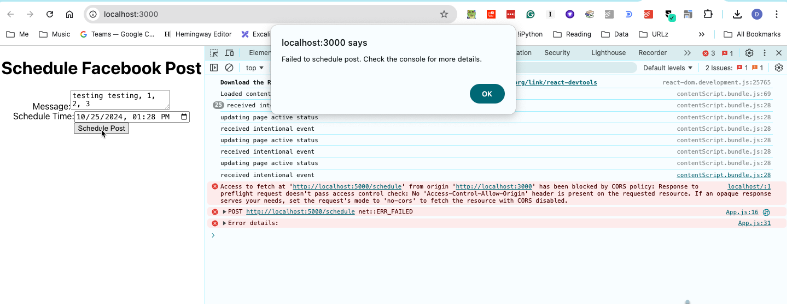
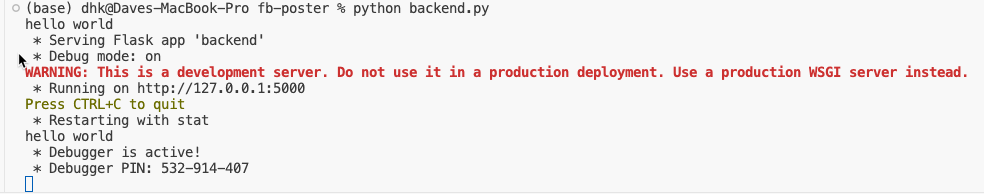
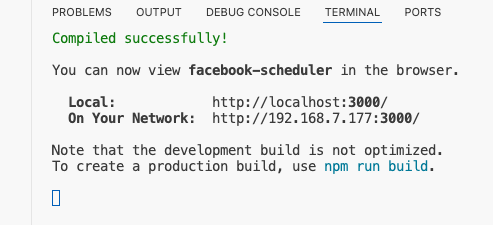

this *should* be a tool to schedule facebook posts.

Right now, it doesn't work. I get the following error in operation:
```
Access to fetch at 'http://localhost:5000/schedule' from origin 'http://localhost:3000' has been blocked by CORS policy: Response to preflight request doesn't pass access control check: No 'Access-Control-Allow-Origin' header is present on the requested resource. If an opaque response serves your needs, set the request's mode to 'no-cors' to fetch the resource with CORS disabled.
```

Frankly, befuddled.

I initiate  via `python backend.py` & then `npm start`

Screenshots of the situation
## sad result in operation
Wha thappens when I click "Scheudle Post"

 
 ## starting the backend
 
 ## starting the front end
 

