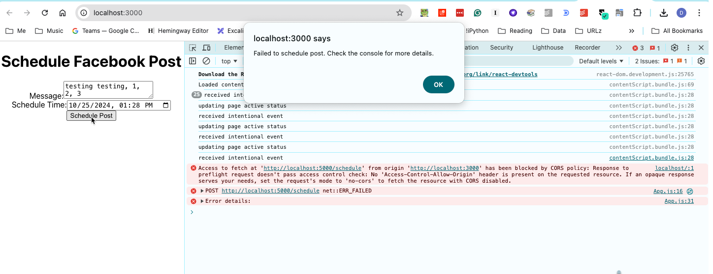
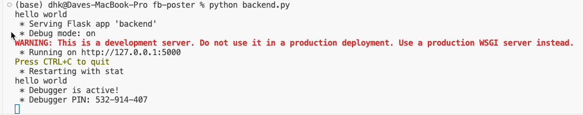
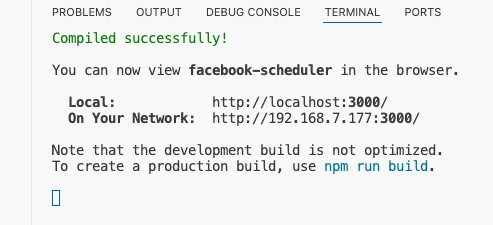

## Project Summary
- Status: Broken
- Problem: Schedule Facebook posts from a simple UI
- Why AI: Prototype the UX quickly and wire it to a lightweight backend
- Artifacts: `backend.py`, `src/`, `facebook-scheduler/`

This *should* be a tool to schedule Facebook posts.

Right now, it doesn't work. I get the following error in operation:
```
Access to fetch at 'http://localhost:5000/schedule' from origin 'http://localhost:3000' has been blocked by CORS policy: Response to preflight request doesn't pass access control check: No 'Access-Control-Allow-Origin' header is present on the requested resource. If an opaque response serves your needs, set the request's mode to 'no-cors' to fetch the resource with CORS disabled.
```

Frankly, I'm befuddled.

I initiate via `python backend.py` and then `npm start`.

Screenshots of the situation
## Sad result in operation
What happens when I click "Schedule Post"

 
## Starting the backend
 
## Starting the front end
 

