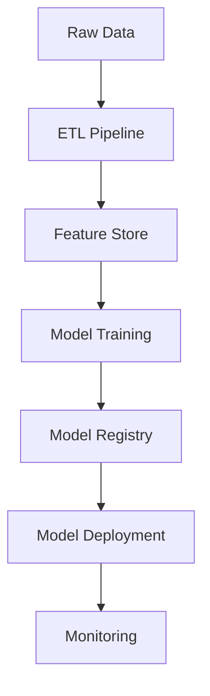
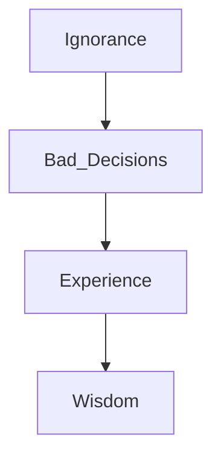

# Discoveries

This document is where I'll provide developer notes, outlining my discoveries along the way.

## 2025-06-28
### Creating Architecture Diagrams
I need to create an architecture diagram. I want to keep it simple 

I asked ChatGPT
```
What’s a good markup tool for creating architecture diagrams in GitHub using CodeSpaces?
```

It recommended Mermaid and gave an example:
```


Note that I was pretty specific in my ask. One of the challenges with using GenAI (and vibe-coding) is to know when to be specific and when to be general. You get wise at this.

Ah: 
```
Please create a mermaid ML that shows how wisdom comes from experience, experience comes from making bad decisions and bad decisions come from ignorance
```
and then
```
Make it a top down diagram ,showing how things are built on top of each other.
```
And I got

```


which renders as 


### First puzzle: getting it to render
By default, mermaid won't render in codespace. So, you have to install a [preview extension](https://marketplace.visualstudio.com/items?itemName=bierner.markdown-mermaid)
