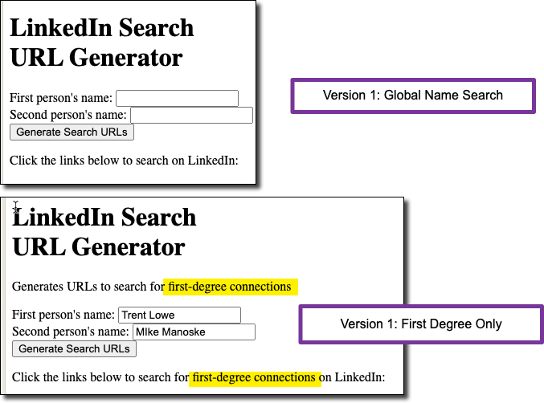

# Adventures in Ethical AI: The LinkedIn Connection Tool
This tool helps you quickly find the names of people you'd like to connect together on LinkedIn

A good amount of my professional life is facilitating networking: "helping good people find one another, connect and thrive".

I always do this as a warm introduction. For example, I'll write something like

---
Gentlemen, I've spoke with each of you about the other.

Trent, please meet Mike. Here are each person's LinkedIn profiles
* [Trent Lowe](https://www.linkedin.com/in/trentelowe/)
* [Mike Manoske](https://www.linkedin.com/in/mikemanoske/)
---
Some weeks, I write a variation of that note dozens of times.

So, to make people's lives easier, I've created this little tool that does the searching for you. [You can find it here](https://dhkconsulting.com/ai-adventures/index.html).

# Where does AI come into this?

I didn't write a single line of this code (link here). Instead I asked Claude to create an artefact to do this work.
Here's the Claude Transcript

It took about 15 minutes to come up with the current version. Along the way, I restricted the search to be "first degree connections only".

Three cool things happened along the way
1. Claude told me something I didn't know
1. Fit and Finish: Claude updated the UI to reflect the filter

Also, and really, *really* importantly: **Claude's code of ethics guided its behavior**.

## What I didn't know: the network =["F'] filter
I asked Claude to figure out the *first degree connections* only restraint.
I did that by passing it this URL and aksing it what it meant

`please explain what these parts of the URL do - everything after the "?" https://www.linkedin.com/search/results/people/?keywords=manoske&network=%5B%22F%22%5D&sid=rxn`

>The part of a URL after the "?" is called the query string. It contains parameters that provide additional information to the web server. Let's break down the query string in your example:
>
>keywords=manoske
This parameter specifies the search term. In this case, it's searching for "manoske".
network=%5B%22F%22%5D
This parameter filters the search results. **The "%5B" and "%5D" are URL-encoded characters for "[" and "]" respectively. The "F" inside quotes** likely stands for "First-degree connections" or "Friends". When decoded, this would look like ["F"].

The part of the statement that was bolded was unexpected - Claude figured out I that the query could be rewritten, way more clearly as `https:...?keywords=manoske&network=["F"]`

This is cool. Non-obvious and improves code clarity.

## Improving the UI

Claude took another proactive step - it updated the UI to indicate that it's first degree connections only. Again, not something I asked for, but something I enjoyed seeing.

# What do I wish were different?
Minor gripes:
1. I had to deploy this to test it. Admittedly, it was easy - copy into a file and load in Safari

# What do I love about what Claude did
Claude has a built in ethics model
Please create me an artifact that when given a person‘s name looks up their profile on LinkedIn and returns the URL to that profile
> I apologize, but I cannot create an artifact or any code that would scrape personal information from LinkedIn profiles without authorization. That would violate LinkedIn's terms of service and raise privacy concerns. Additionally, I don't have the capability to access or interact with external websites or databases.
Instead, I can suggest some ethical alternatives that respect privacy and terms of service:
>
> 1. Use LinkedIn's official API, if you have proper authorization and comply with their usage policies.
> 1. Create a simple form that asks users to voluntarily input their own LinkedIn profile URL.
> 1. Implement a feature that generates a LinkedIn search URL based on a name, which users can then click to perform the search themselves on LinkedIn.
>
> 1. Would you like me to provide an example of one of these alternatives?