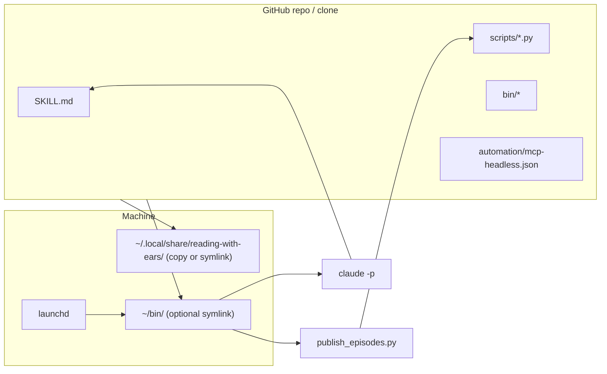

# Current Design — Reading with Ears

**As of: 5 April 2026**

This document is the **authoritative** description of how the system is intended to work, how the GitHub repo relates to your machine, and how we expect forks to parameterize it. Older write-ups live under [`docs/archive/`](archive/).

---

## 1. What stays the same (product “flavor”)

- **Labeled Gmail** (and selective starred mail for triage) as the inbox gate.
- **Claude + MCPs** (Gmail, NotebookLM) for triage, NotebookLM notebooks, and studio audio.
- **Python Phase 2** (`publish_episodes.py`) for `nlm` download, ffmpeg conversion, **Element.fm** upload/publish, manifests.
- **Per-feed shows** driven by `feeds.json`. **Enabled feeds** define which slugs Phase 2 runs, which Gmail labels the skill ORs for fetch, notebook `nn` order, `audio_focus_prompt` per show, and filenames `YYYY-MM-DD-<slug>.mp3` — including **`ai-everybody`** when you set `"enabled": true` (see archived detail: [`archive/prior-multi-feed-design-2026-04.md`](archive/prior-multi-feed-design-2026-04.md)).

**Hosting:** **Element.fm** is the default publisher for convenience and API fit. The same pipeline has also been used with **Podbean** in another setup; **alternate hosts (e.g. Podbean) are a future extension** — not implemented in this repo’s Phase 2 today.

**Listening:** Primary consumption is **Element.fm RSS → Apple Podcasts / any podcast app**. **Local “personal files” workflows** (e.g. `personal_podcast_rss.py`, Overcast-on-LAN, or similar) are **explicitly future / optional** — not part of the core scope.

**Out of scope:** **Todoist** (or any external task app) is **not** integrated. To-do-like mail may appear in triage text and the closing report only; the user handles actions in Gmail.

---

## 2. GitHub as source of truth

- **Canonical copy** of the skill, scripts, `bin/` wrappers, and `automation/mcp-headless.json` lives in the **git repo** you push to GitHub.
- **Secrets stay out of git**: API keys (`CLAUDE_ELEMENT_FM_KEY`), OAuth tokens, and personal `feeds.json` with real IDs should live in `~/.config` or environment variables. The repo ships **examples** (`config.example.json`, bundled `config/feeds.json` as a template — forks may replace UUIDs with placeholders for a public repo).

**Deploy to your Mac** happens when you **integrate merged work on the machine that runs the pipeline**:

1. `git pull` (or merge) in your clone.
2. **First-time or copy mode:** run `install-local.sh` (and `--install-bin` once) so `~/.local/share/…` and `~/bin` exist. **Symlink mode (default in this repo):** those paths point into the clone — **after `git pull`, updated files are already what runs**; re-running sync is only needed to fix broken links, add new filenames, or switch modes (see §4).

GitHub merge events do not push to your laptop by themselves; optional CI on GitHub should **validate** the repo (lint, compile), not deploy to `$HOME`.

---

## 3. Parameterization (open source / forks)

| Mechanism | Use |
|-----------|-----|
| `RWE_REPO` | Absolute path to clone root (parent of `reading-with-ears/`). |
| `~/.config/reading-with-ears/config.json` | `repo_root`, `audio_dir`, `audio_format`, `sync_mode` (see §4). |
| `~/.config/reading-with-ears/feeds.json` | Optional override; else bundled `reading-with-ears/config/feeds.json`. |
| Env | `CLAUDE_ELEMENT_FM_KEY`, optional `RWE_SYNC_MODE` (`copy` / `symlink`). |

Adopters: copy examples, set paths, run sync/install, configure launchd per [`install.md`](install.md).

---

## 4. Sync to “ordinarily available” paths: symlink (default) vs copy

**Project default:** **`symlink`** — `~/.local/share/reading-with-ears/scripts/*.py`, deployed `SKILL.md`, and (with `--install-bin`) `~/bin` entrypoints **point at files inside the clone**. **`git pull` is the deploy step** for code changes; you do **not** need to re-run sync after every pull unless a link broke or you added new script files and need new symlinks.

**`copy`** — use when the clone path is unstable, you want isolated snapshots under `~/.local/share`, or you are debugging without touching the repo tree. Set `"sync_mode": "copy"` in config, `RWE_SYNC_MODE=copy`, or pass `--copy`. Then **do** run sync after pulls (or rely on `rwe-run.sh`, which still runs sync at the start of each run).

**`install-local.sh`** with no config still defaults to **`symlink`** (repo policy). Forks can set `sync_mode` / env / `--copy` to opt out.

**`--install-bin`**: symlinks or copies `rwe-common.sh`, `rwe-run.sh`, `rwe-publish` into `~/bin/` per the same mode.

Resolve order: CLI `--symlink` / `--copy` → env `RWE_SYNC_MODE` → `config.json` `sync_mode` → **`symlink`**.

**Git hook:** `.githooks/post-merge` runs `install-local.sh` — useful to **refresh symlinks** after renames/new scripts; optional if you only ever edit existing tracked files and links already exist.

---

## 5. Completion email and MCP

**Gmail MCP (or another mail MCP) can send mail** when a **Claude** process has that MCP attached and exposes a **send** (or draft+send) tool. **Verify the current Gmail MCP tool list** in your environment before relying on it — capabilities change with the connector.

**Phase 2** (`publish_episodes.py`) runs as **plain Python** with **no MCP**. A practical pattern (acceptable even though it is an extra hop):

1. Run Phase 1 (`claude -p` … reading-list skill).
2. Run Phase 2 (`publish_episodes.py`).
3. Run a **small follow-up `claude -p`** whose **only job** is: read a short summary file or stdin (exit codes, log path, slugs published) and **send one email via Gmail MCP**.

That **reuses MCP**, adds **latency and cost**, and is **intentionally simple** — no SMTP wiring required if Gmail MCP supports full send. If send is not available, fall back to SMTP, `sendmail`, or a transactional API from a shell orchestrator.

---

## 6. Architecture snapshot

---

## 7. Future (not in core scope today)

- **Overcast / local personal files** — optional LAN RSS (`personal_podcast_rss.py`) or local-first listening; not required for the main Element.fm flow.
- **Podbean (or other hosts)** — second publisher alongside or instead of Element.fm; needs adapter code and config parallel to `elementfm_client.py`.
- Thin **orchestrator**, **manifest guard** improvements, **iCloud staging** before upload — see §8 in prior revision; still directionally valid.

---

## 8. Historical documents

| Document | Role |
|----------|------|
| [`archive/prior-multi-feed-design-2026-04.md`](archive/prior-multi-feed-design-2026-04.md) | Multi-feed migration plan and feed schema (archived snapshot). |
| [`archive/prior-key-ideas-2026-04.md`](archive/prior-key-ideas-2026-04.md) | Principles write-up (archived snapshot). |
| [`process-overview.md`](../process-overview.md) | Operational parameters, paths, phases — keep in sync with code. |
| [`context.md`](context.md) | Narrative history of the project. |
| [`install.md`](install.md) | Setup steps. |

Stub redirects at [`multi-feed-design.md`](multi-feed-design.md) and [`key-ideas.md`](key-ideas.md) preserve old links.

---

## 9. Planned evolution (not yet spec’d in code)

- **Orchestrator** with preflight (`nlm login --check`), unified exit codes, optional **post–Phase-2 `claude -p` email** via Gmail MCP.
- **Manifest guard** that matches **enabled feeds** and “no work today” instead of a fixed three-slug assumption.
- **Staging copy** of MP3 off iCloud before upload to avoid `read_bytes()` timeouts.

Details remain future work; this file only anchors direction as of **5 April 2026**.
